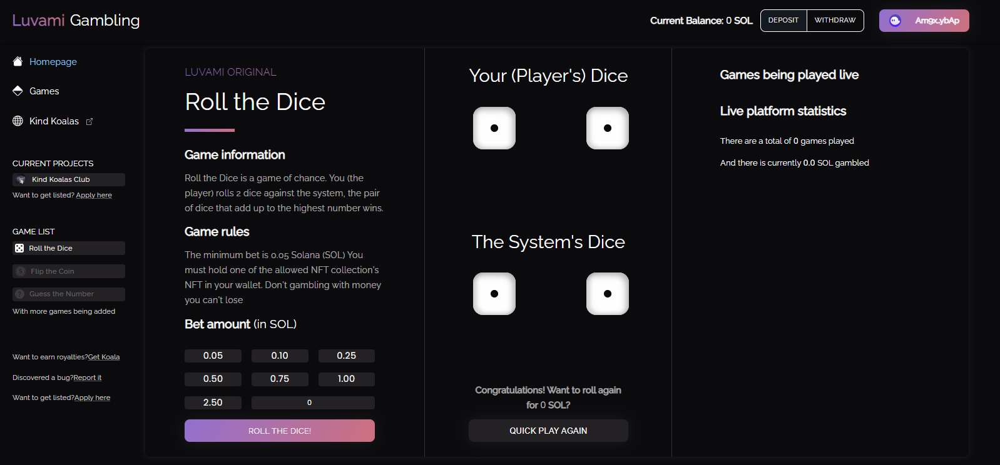

# Blockchain Projects: (SOLANA / EVM / NEAR)

You can find my past works here. Most of projects(repos) are in private status.
 
<h3><u><strong><i>Jackpot Game</i></strong></u> &nbsp;(SOLANA)</h3>

The Slowrug is a kind of Jackpot game which has initially 2 rooms (Tower, Graveyard).
The players can enter in the game with their own bet amount and after the game finished, the winner can get the whole bet value from the platform.

- Original Link: <a href="https://slowrug.io/" target="_blank">Slowrug</a>
  - You can play game with SOL with this site
  - You can win and get the whole bet amount

- Github repo: 
  - Jackpot Game FE: <a href="https://github.com/dev-tom-0108/Jackpot_Game_Frontend" target="_blank">FE code</a>
  - Jackpot Game BE: <a href="https://github.com/dev-tom-0108/Jackpot_Game_Backend" target="_blank">BE code</a>
  - Jackpot Game Program: <a href="https://github.com/dev-tom-0108/Jackpot_Game/tree/main/Jackpot_program" target="_blank">Program code</a>
  
- Social Link: <a href="https://twitter.com/Bet3NFT" target="_blank">Twitter Link</a> 

<h3><u><strong><i>Yieldz-Defi</i></strong></u> &nbsp;(Core)</h3>

Yieldz is the first multi Layered real-yield DeFi ecosystem. Our mission is to provide a sustainable system and bring stability and long-term solutions for Defi investors. YIELDZ is also a multifaceted Ecosystem, innovative Stablecoin, and Core Farm.

- Original Link: <a href="https://yieldzprotocol.com/" target="_blank">Yieldz Protocol</a>
  - You can Bond / Stake / Boost YZ by using this protocol
  - You can get lots of Rewards as $SHDW and $CORE

- Github repo: 
  - Yieldz Protocol Smart Contract: <a href="https://github.com/dev-tom-0108/Double_yield_staking_solidity" target="_blank">Smart Contract code</a>
  
- Social Link: <a href="https://twitter.com/Yieldzprotocol" target="_blank">The Yieldz-twitter</a>
  

<h3><u><strong><i>Solarmy Game</i></strong></u> &nbsp;(SOLANA)</h3>

The Solarmy is an interdimensional freedom fighting army of the future where all members are connected to each other through a high tech implant

- Original Link: <a href="https://game.solarmy.io/" target="_blank">Solarmy Game</a>
  - You can play game with Solarmy 3D NFTs with this site
  - You can stake solarmy 2D NFTs

- Github repo: 
  - Solarmy Game FE: <a href="https://github.com/dev-tom-0108/Solarmy-FE" target="_blank">FE code</a>
  - Solarmy Game BE: <a href="https://github.com/dev-tom-0108/Solarmy-Backend-Api" target="_blank">BE code</a>
  - Solarmy Game Program: <a href="https://github.com/dev-tom-0108/Solarmy-Staking-Program" target="_blank">Program code</a>
  
- Social Link: <a href="https://twitter.com/TheSolarmy" target="_blank">The Solarmy-twitter</a>
  
<h3><u><strong><i>Coinflip Game</i></strong></u> &nbsp;(SOLANA)</h3>

This is the Coinflip game for Solana network

- Original Link: <a href="https://coinflip.deezkits.com/" target="_blank">Coinflip Game</a>

- Github repo: 
  - Coinflip Game FE: <a href="https://github.com/dev-tom-0108/Coinflip-Game/tree/main/coinflip-frontend" target="_blank">FE code</a>
  - Coinflip Game BE: <a href="https://github.com/dev-tom-0108/Coinflip-Game/tree/main/backend" target="_blank">BE code</a>
  - Coinflip Game Program: <a href="https://github.com/dev-tom-0108/Coinflip-Game/tree/main/coinflip-smart-contract" target="_blank">Program code</a>
  
- Social Link: <a href="https://mobile.twitter.com/deezkits" target="_blank">Deezkits-twitter</a>

<h3><u><strong><i>DustyVaults</i></strong></u> &nbsp;(BSC)</h3>

We are a safe, boring NFT vault. That is very $Dusty. You can pay us to store your NFT’s for the next year. We’re going to lock them in an old vault and keep a watchful eye on them. Like anything put in storage it will get $Dusty over time. In fact at the end of 12 months you can withdraw your NFT, plus your original funds, plus all your accumulated $Dusty tokens.

- Original Link: <a href="https://dustyvaults.net/" target="_blank">Dusty Vaults</a>

- Github repo: <a href="https://github.com/dev-tom-0108/dusty-valuts-v2" target="_blank">Dusty-Vaults_Staking</a>
- Social Link: <a href="https://twitter.com/DustyVaultsNFT" target="_blank">Dusty Vaults-twitter</a>

<h3><u><strong><i>Seattle-SuperKongs-Staking</i></strong></u> &nbsp;(Ethereum)</h3>

30% (30 Million) of the total DUNK token supply is allocated to the Club Key NFTs, which act as the primary investment into the Seattle SuperKongs Club. In return for the early investment into the SuperKongs, Club Key NFT holders are given a majority percentage of the DUNK token supply. The Club Key NFTs must be staked
to access the DUNK token distribution. The NFT staking mechanism allows the DUNK tokens to be vested to holders over time

- Original Link: <a href="https://superkongz-staking.netlify.app/" target="_blank">Seattle_SuperKongs_Staking</a>

- Official Link: <a href="https://www.superkongs.io/" target="_blank">Seattle_SuperKongs</a>

- Github repo: 
  - <a href="https://github.com/Seattle-SuperKongs/NFT_Staking_FE" target="_blank">FrontEnd Code</a>
  - <a href="https://github.com/Seattle-SuperKongs/NFT_Staking_contract" target="_blank">NFT Staking Smart Contract Code</a>
  - <a href="https://github.com/Seattle-SuperKongs/DUNK_token_contract" target="_blank">DUNK Token Smart Contract Code</a>
- Social Link:
  - <a href="https://twitter.com/SeaSuperkongs" target="_blank"> SuperKongs-Twitter </a>
  - <a href="https://www.instagram.com/seattlesuperkongs/?hl=en" target="_blank"> SuperKongs-Instagram </a>

<h3><u><strong><i>FoxFinance</i></strong></u> &nbsp;(BSC)</h3>

We’ll also be hosting a charity auction with the winning artwork, allowing the FOX community to own a piece of history in the form of an NFT, with proceeds going to a wildlife-oriented charity we plan to reveal it soon.

- Original Link: <a href="https://foxfinance.io/Marketplace" target="_blank">Fox Finance</a>

- Github repo: <a href="https://github.com/dev-tom-0108/nuxt-fox-nft-marketplace" target="_blank">Fox Finance Marketplace</a>

<h3><u><strong><i>Honey Finance</i></strong></u> &nbsp;(AVALANCHE/SOLANA)</h3>

This is one of the big project, I have built NFT lending/borrowing system on Avalanche/Solana. You can lend and borrow NFT from this site and the price comes from the NFT oracle.

So you deposit this collateral, we see it belongs to collection X so the floor price is Y. We send 70% of Y (assuming the loan to value is 70%) and the loan begins. 

Now two things can happen (already coded in compound). Interest is accumulating, either you pay back the loan + interest and it sends your collateral back, or the loan + interest is too high and it sends it to a liquidation smart contract. 

- Original Link: <a href="https://honey.finance" target="_blank"> Honey Finance </a>

- Github repo: <a href="https://github.com/honey-labs/evm-lend-nft" target="_blank">Honey Finance NFT Lend</a>

<h3><u><strong><i>TAC Staking</i></strong></u> &nbsp;(Aurora)</h3>

This is the traditional NFT staking project. Users stake their TAC NFTs and receive 🍌$BGA token.

- Link: <a href="https://aurora-staking.vercel.app/" target="_blank">TAC Staking</a>
  - You can stake your TAC NFT.
  - You will receive reward as 🍌$BGA calculated by 25 days.
- Original Link: <a href="https://www.theapedao.finance/" target="_blank">Buy $BGA|APe DAO</a>
- Github repo : <a href="https://github.com/dev-tom-0108/NFT-staking-aurora" target="_blank">TAC-NFT-Staking</a>  

<h3><u><strong><i>LaidBackLlamas</i></strong></u> &nbsp;(Ethereum)</h3>

This is the easy NFT minting site which has one landig page.

In this project, I built the NFT minting contract by using Solidity. 
In this smart contract, I built WL Member Function, OG Member Function, and Reveal Time Function. Before reveal time ends, you can’t see your NFTs. It uses the different metadata URIs.

- Original Link: <a href="https://www.laidbackllamas.com" target="_blank">Laid Back Llamas</a>
- <h5>NDA</h5>

<h3><u><strong><i>Astronaut NFT Staking</i></strong></u> &nbsp;(Solana)</h3>

Multiple Factor Rewards Staking program for 👩🏿‍🚀Astronaut👨🏿‍🚀 NFT collections

- Demo: <a href="http://astronaut-nft-staking-death.vercel.app">Astronaut Staking</a>
- Live: <a href="https://minxlabs.io/cosmicastro/staking">cosmicastro NFT Staking </a>

- Official Links:
  - Website: <a href="https://www.cosmicastronauts.com">Cosmic Astronaut</a>
  - Dashboard: <a href="https://minxlabs.io">Minx Labs Dashboard</a>
- Github repo: <a href="https://github.com/dev-tom-0108/Astronaut-NFT-Staking">Astronaut-NFT-Staking-death</a>

<h3><u><strong><i>Burning Masked Ape Dao</i></strong></u> &nbsp;(Solana)</h3>

This is burning mechanism to burn NFTs have no metadata in Masked Ape collection. Max burn per wallet per day would be 1 burn to prevent whales easily hoarding MAD tokens by burning blank NFTs. Here is the official links and smart contract repo link.

- Demo: <a href="https://burning-masked-ape.vercel.app">Burning Masked Ape</a>
- Live: <a href="https://maskedapedao.com">Bruning_Masked_Ape_DAO</a>
  - Functionality
    - 848 Masked Apes have missing attributes, we want a dApp to burn them for $MAD tokens. (eg. blank attributes Masked Ape
    - We will deposit 8,480,000 $MAD in a vault so users can burn and receive 10,000 $MAD tokens.
    - Users can burn nft has no metadata.
- $MAD tokens contract: <a href="https://solscan.io/token/GkXn6PUbcvpwAzVCgJFychVhAhjwZRMJWmtqzar3SnqG">$MAD token</a>    
- Magic Eden: <a href="https://magiceden.io/marketplace/maskedapedao">maskedapedao</a>
- Offical Links: <a href="https://maskedapedao.xyz">Anonymous Masked Ape DAO</a>
- Github repo: <a href="https://github.com/dev-tom-0108/Burning_Masked_Ape">Burning_Masked_Ape</a>

<h3><u><strong><i>Wild West Verse</i></strong></u> &nbsp;(Solana)</h3>

  
You can participate to the WWV Lottery and the WWV Auction, stake your $WWV Token or sell it on the market with the stakes you earn.
  
- Staking Link: <a href="https://staking.wildwestverse.io" target="_blank">WWV Staking</a>
  - RANK /DAILY PRIZE -> 1500-2000 /1$WWV, 1000-1499 /1.5$WWV, 600-999 /2$WWV, 300-599 /2.5$WWV, 200-299 /3$WWV, 51-199 /4$WWV, 1-50 /5$WWV
  - If your NFT is rarer you will get more staking reward.
  - Whenever you want. But keep in mind that you won't be able to get any more staking income.
- Original Link: <a href="https://www.wildwestverse.com" target="_blank">Wild West Verse</a>
- Github repo: <a href="https://github.com/dev-tom-0108/WorldWiseVerse-Staking" target="_blank">WWV-NFT-Staking</a>

<h3><u><strong><i>Kingdom of Dwarves</i></strong></u> &nbsp;(Solana)</h3>

Multiple Factor Rewards Staking program for Kingdom of Dwarves NFT collections
  
- Create KCRWN token: Link--> <a href="https://solscan.io/token/56bFarytGNPXnA34WbghfHoHQJ7NqKSKyTSnfmACdYtk#holders" target="_blank">KCRWN</a>
- Staking Link: <a href="http://16.170.178.222:3001" target="_blank">KCRWN Staking</a>
  - users can reward according to their NFT rare
  - Whenever you want. But keep in mind that you won't be able to get any more staking income.
- Original Link: <a href="https://www.kingdomofdwarves.io" target="_blank">Kingdom of Dwarves</a>
- Github repo: <a href="https://github.com/dev-tom-0108/KoD-NFT-Staking" target="_blank">Dwarves-staking</a>
- Kod Story: <a href="https://kod-app.netlify.app/" target="_blank">KoD-Story</a>
 
<!-- <h3><u><strong><i>FLWR Staking</i></strong></u> &nbsp;(Solana)</h3>

Staking an SPL token "FLWR"

- Link: <a href="https://majestic-alpaca-f02e82.netlify.app" target="_blank">FLWR Staking</a>
- Live URL: <a href="https://flwrstaking.solflowers.io/" target="_blank">SOL Flowers Staking</a>
  - number of flwr (spl-token) - 50/75/100%
  - reward period/lock time  - 4/6/12 month
  - interest  - 3%/6%/12%
  - penalties for early withdrawl - 6/12/24%
  - transaction fee < .1 sol
- Original Link: <a href="https://dex.solflowers.io" target="_blank">FLOWERS Solana Marketplace</a>
- Github repo : <a href="https://github.com/dev-tom-0108/FLOWER-spl-staking" target="_blank">FLWR-staking</a>
     -->

<h3><u><strong><i>Luvami Gambling</i></strong></u> &nbsp;(Solana)</h3>

This is the Dice game. The random number will be created in blockchain and compare the system's Dice and user's Dice.

- Link: <a href="https://dice-game-frontend.vercel.app/" target="_blank">Luvami Gambling</a>
  - You can deposit 0.05, 0.1, 0.25, 0.5, 0.75, 1, 2.5 SOL
  - If you win, you receive the 2 times, you earn
  - If you lost, you can't receive at all.
- Github repo : <a href="https://github.com/dev-tom-0108/Dice-Rust" target="_blank">DICE</a>  

<h3><u><strong><i>Apex Raffle House</i></strong></u> &nbsp;(Solana)</h3>

This is the raffle project that winners can receive the raffle NFT or winners can buy NFTs by half price by buying tickets. You can buy tickets by using $PREY and $SOL.

- Demo: <a href="http://apex-raffle.vercel.app">ApeX Raffle House</a>
- Live: <a href="http://apex-raffle.vercel.app">ApeX Raffle House</a>
  - Payment method
    - $SOL, $PREY (SPL token)
  - Reward Type
    - Receive NFT, WL spots(max: 50), Reward Token
- Official Links:
  - Linktree: <a href="https://linktr.ee/ApexPredatorsSOL">Apex Predator | Linktree</a>
  - Website: <a href="https://home.apexpredator.army">Apex Predator</a>
  - Staking: <a href="https://apex-staking.vercel.app">Apex Predator | Staking</a>
- Github repo: <a href="https://github.com/dev-tom-0108/ApeX-Raffle-program">Apex-Raffle</a>

<h3><u><strong><i>EU(Eternal Underworld) Raffle</i></strong></u> &nbsp;(Solana)</h3>

This is the raffle project that winners can receive the raffle NFT or winners can buy NFTs by half price by buying tickets. You can buy tickets by using 🍂$REAP and $SOL.

- Link: <a href="https://eu-raffle.vercel.app/raffle" target="_blank">EU Raffle</a>
  - Payment method
    - SOL
    - $REAP (SPL token)
  - Reward Type
    - Reveive NFT
    - Whitelist (Max value is 50)
    - Tickets (Max value is 2000)
- Original Links:
  - Website: <a href="https://www.daku-reapers.com" target="_blank">Daku-Reapers Ressurection</a>
  - Auction: <a href="https://daku-reapers.auction" target="_blank">Daku-Reapers Auction</a>
  - Staking: <a href="https://daku-reaper-staking.vercel.app" target="_blank">Daku-Reapers Staking</a>
- Github repo: <a href="https://github.com/dev-tom-0108/raffle-frank-rust" target="_blank">EU-raffle</a>

<h3><u><strong>MetaKongz Raffle</strong></u> &nbsp;(Solana)</h3>

This is the raffle project that winners can receive the raffle NFT or winners can buy NFTs by half price by buying tickets. You can buy tickets by using 🦴$BOOGA, 🍭$ZION, and $SOL.

- Link: <a href="https://metakongz-raffle-auction.vercel.app/raffle" target="_blank">MetaKongz Raffle</a>
- Live Link: <a href="https://metakongz-metamart.vercel.app">MetaKongz Raffle</a>
  - Payment method
    - $SOL, $BOOGA, $ZION
  - Reward Type
    - Receive NFT, WL spots(max: 50)
- Original Links:
  - Website: <a href="https://www.metakongz.art" target="_blank">MetaKongz</a>
  - Staking: <a href="https://metakongz-staking.vercel.app" target="_blank">MetaKongz Staking</a>
- Github repo: <a href="https://github.com/dev-tom-0108/raffle-pro-contract" target="_blank">raffle-auction-prospect3</a>

<h3><u><strong><i>Auction House</i></strong></u> &nbsp;(Solana)</h3>

This is the auction platform that users can bid with several 💵spl-tokens and the highest bidder(winner) will be receive the NFT.

- Link: <a href="https://auction-doge.vercel.app/auction">Doge Auction</a>
- Online link: <a href="https://mausoleum.tombstoned.xyz">The Mausolem Auction</a>
  - Payment method
    - SOL
    - Various SPL tokens
  - Reward Type
    - NFT
- Official Links:
  - Website: <a href="https://www.thedogecapital.com">Doge Capital:</a>
  - Staking: <a href="https://staking.thedogecapital.com">Doge Capital NFT Staking:</a>
  - CoinFlip: <a href="https://degencoinflip.com/dogecapital">Degen Coin Flip:</a>
  - Twitter: <a href="https://twitter.com/thedogecapital">Doge Capital:</a>
- Github repo: <a href="https://github.com/dev-tom-0108/auction-doge-rust">auction-doge</a>
  - Project Structure:
    - Auction contract
    - Auction api
    - Front-end
